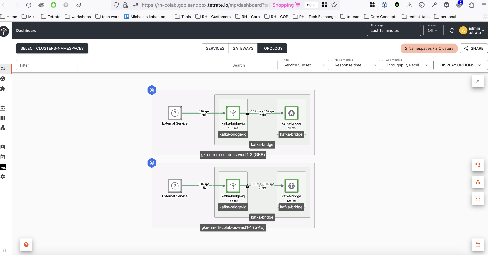
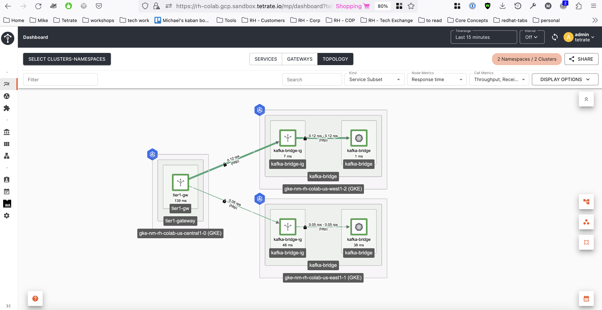

# TSB Setup

## Prep:

### TSB Installation

- [tetrate-service-bridge-sandbox](https://github.com/tetrateio/tetrate-service-bridge-sandbox) repo has been used to provision both MP and CP clusters on GCP
- Cluster where MP is, onboarded and ( tier1, gitops enabled )
- Clusters onboarded and gitops enabled
- Setup network and reachability settings between clusters

### Inject the sidecar in the bridge namespaces

In the previous step we had the kafka bridges working, now we need to inject a sidecar proxy and restart the deployments on each k8s cluster where they are running:

```shell
k label ns kafka-bridge istio-injection=enabled
namespace/kafka-bridge labeled
```

```shell
k rollout restart deployment kafka-bridge-bridge -n kafka-bridge
deployment.apps/kafka-bridge-bridge restarted
```

```shell
k get pods -n kafka-bridge
NAME                                  READY   STATUS    RESTARTS   AGE
kafka-bridge-bridge-b86c49748-f7x96   2/2     Running   0          43s
```

Now test your kafka bridge with a sleep container:

```shell
k apply -f https://raw.githubusercontent.com/istio/istio/master/samples/sleep/sleep.yaml -n kafka-bridge
```

```shell
export SLEEP_POD=$(kubectl get pod -n kafka-bridge -l app=sleep -o jsonpath={.items..metadata.name})
```

```shell
kubectl exec -it $SLEEP_POD -n kafka-bridge -c sleep -- curl -X GET http://kafka-bridge-bridge-service.kafka-bridge.svc.cluster.local:8080/topics
```

Check the proxy sidecar logs for the request:

```shell
k logs kafka-bridge-bridge-b86c49748-f7x96 -n kafka-bridge -c istio-proxy
```

## Deployments and Config

Deploy the TSB Tenant, Workspace, Workspace Settings and Gateway group:

`NOTE` For demo purposes this is done in the central k8s cluster

```bash
kustomize build tsb --reorder none | k apply -f -
```

Now deploy the ingress gateways in East and West:

`NOTE` The command below needs to be run in each East/West k8s clusters.

```bash
kustomize build ingress-gateway-east --reorder none | k apply -f -
```

```bash
kustomize build ingress-gateway-west --reorder none | k apply -f -
```

Check the ingress gateway is running:

```shell
k get pods -n kafka-bridge
NAME                                  READY   STATUS    RESTARTS   AGE
kafka-bridge-bridge-b86c49748-lrhwn   2/2     Running   0          2m25s
kafka-bridge-ig-ddf7b8fbc-n94bg       1/1     Running   0          13m
sleep-78ff5975c6-mt95c                2/2     Running   0          88m
```

Now lets get the ingress gateway public IP and test the bridge on each region:

```shell
export GATEWAY_KAFKA_IP=$(kubectl -n kafka-bridge get service kafka-bridge-ig -o jsonpath='{.status.loadBalancer.ingress[0].ip}')
```

```shell
curl -k -v "http://kafka.tetrate.work/topics" \
    --resolve "kafka.tetrate.work:80:${GATEWAY_KAFKA_IP}"
```

Expect a response like:

```shell
* Added kafka.tetrate.work:80:35.237.238.246 to DNS cache
* Hostname kafka.tetrate.work was found in DNS cache
*   Trying 35.237.238.246:80...
* Connected to kafka.tetrate.work (35.237.238.246) port 80 (#0)
> GET /topics HTTP/1.1
> Host: kafka.tetrate.work
> User-Agent: curl/7.87.0
> Accept: */*
> 
* Mark bundle as not supporting multiuse
< HTTP/1.1 200 OK
< content-type: application/vnd.kafka.v2+json
< content-length: 83
< x-envoy-upstream-service-time: 165
< date: Thu, 27 Jul 2023 18:47:30 GMT
< server: istio-envoy
< 
* Connection #0 to host kafka.tetrate.work left intact
["__strimzi_store_topic","__strimzi-topic-operator-kstreams-topic-store-changelog"]
```

Make several requests to each ingress gateway at each k8s cluster and navigate to the TSB UI topology view to see the traffic, expect something like this:



Now we are ready to deploy the tier1 gateway that load balance traffic between the two regional ingress gateways:

`NOTE` Don't forget to update the tier1 gateway config with the onboarded TSB cluster names.
`NOTE` For demo purposes the tier1 gateway is being deployed in the central k8s cluster.

```bash
kustomize build tier1-gateway --reorder none | k apply -f -
```

Test the tier1 gateway by generating traffic:

```shell
export GATEWAY_T1_IP=$(kubectl -n tier1-gateway get service tier1-gw -o jsonpath='{.status.loadBalancer.ingress[0].ip}')
```

```shell
while true; do curl -k "http://kafka.tetrate.work/topics" --resolve "kafka.tetrate.work:80:${GATEWAY_T1_IP}"; sleep 0.5; done
```

Expect traffic to be split between the two ingress gateways:



Now we are ready to test failover of the Kafka bridge across regions.
