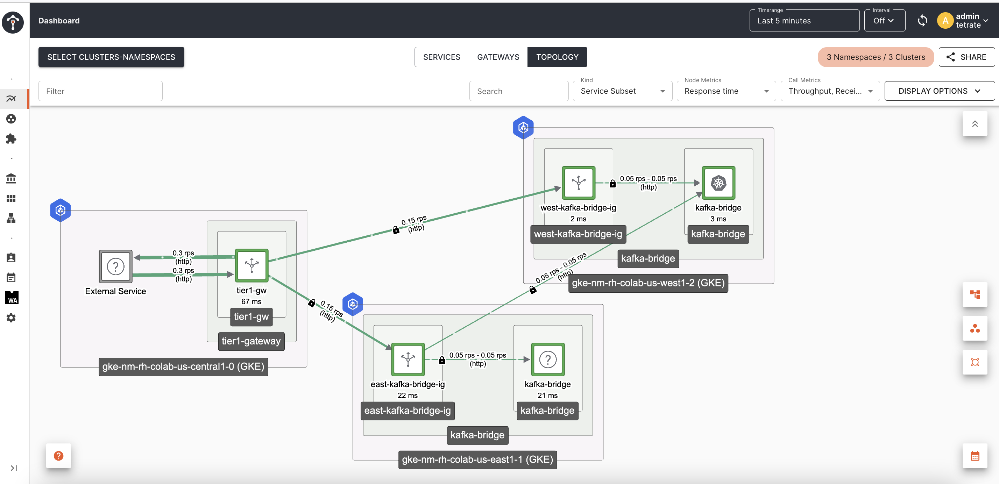

# Test Kafka Bridge failover with TSB

Now that we have a working setup we are going to deploy a couple traffic generators that are going to emulate the production and consumption of messages to the exposed endpoint on our tier1 gateway so we can failover one of the bridges.

`NOTE` For demo purposes we are going to deploy the producer and consumers in the same central k8s cluster where we have the tier1 gateway.

## Creating a Kafka Bridge consumer

Create a couple consumers:

```shell
curl -k -X POST "http://kafka.tetrate.work/consumers/bridge-quickstart-consumer-group" --resolve "kafka.tetrate.work:80:${GATEWAY_T1_IP}" \
  -H 'content-type: application/vnd.kafka.v2+json' \
  -d '{
    "name": "consumer1",
    "auto.offset.reset": "earliest",
    "format": "json",
    "enable.auto.commit": false,
    "fetch.min.bytes": 512,
    "consumer.request.timeout.ms": 30000
  }'
```

Expect a response like:

```shell
{"instance_id":"consumer1","base_uri":"http://kafka.tetrate.work:80/consumers/bridge-quickstart-consumer-group/instances/consumer1"}
```

```shell
curl -k -X POST "http://kafka.tetrate.work/consumers/bridge-quickstart-consumer-group" --resolve "kafka.tetrate.work:80:${GATEWAY_T1_IP}" \
  -H 'content-type: application/vnd.kafka.v2+json' \
  -d '{
    "name": "consumer2",
    "auto.offset.reset": "earliest",
    "format": "json",
    "enable.auto.commit": false,
    "fetch.min.bytes": 512,
    "consumer.request.timeout.ms": 30000
  }'
```

Expect a response like:

```shell
{"instance_id":"consumer2","base_uri":"http://kafka.tetrate.work:80/consumers/bridge-quickstart-consumer-group/instances/consumer2"}
```

Now subscribe the created consumers to the consumer group:

Consumer1:
```shell
curl -k "http://kafka.tetrate.work/consumers/bridge-quickstart-consumer-group/instances/consumer1/subscription" --resolve "kafka.tetrate.work:80:${GATEWAY_T1_IP}" -H 'content-type: application/vnd.kafka.v2+json' -d '{"topics": ["bridge-quickstart-topic"]}' -v
```

Consumer2:
```shell
curl -k "http://kafka.tetrate.work/consumers/bridge-quickstart-consumer-group/instances/consumer2/subscription" --resolve "kafka.tetrate.work:80:${GATEWAY_T1_IP}" -H 'content-type: application/vnd.kafka.v2+json' -d '{"topics": ["bridge-quickstart-topic"]}' -v
```

Expect a `204` response code with no content.

Test producing messages using the Bridge:

```shell
curl -k "http://kafka.tetrate.work/topics/bridge-quickstart-topic" --resolve "kafka.tetrate.work:80:${GATEWAY_T1_IP}" -H 'content-type: application/vnd.kafka.json.v2+json' -d '{"records": [{"key": "my-key", "value": "sales-lead-0001"}, {"value": "sales-lead-0002"}, {"value": "sales-lead-0003"}]}' -v
```

Expect a response like:

```json
{"offsets":[{"partition":0,"offset":11},{"partition":0,"offset":12},{"partition":0,"offset":13}]}
```

Now test retrieving messages from the consumers:

```shell
curl -k "http://kafka.tetrate.work/consumers/bridge-quickstart-consumer-group/instances/consumer1/records" --resolve "kafka.tetrate.work:80:${GATEWAY_T1_IP}" -H 'accept: application/vnd.kafka.json.v2+json' -v
```

```shell
curl -k "http://kafka.tetrate.work/consumers/bridge-quickstart-consumer-group/instances/consumer2/records" --resolve "kafka.tetrate.work:80:${GATEWAY_T1_IP}" -H 'accept: application/vnd.kafka.json.v2+json' -v
```

Expect a response like:

```shell
[{"topic":"bridge-quickstart-topic","key":"my-key","value":"sales-lead-0001","partition":0,"offset":0},{"topic":"bridge-quickstart-topic","key":"my-key","value":"sales-lead-0001","partition":0,"offset":1},{"topic":"bridge-quickstart-topic","key":"my-key","value":"sales-lead-0001","partition":0,"offset":2},{"topic":"bridge-quickstart-topic","key":"my-key","value":"sales-lead-0001","partition":0,"offset":3},{"topic":"bridge-quickstart-topic","key":null,"value":"sales-lead-0003","partition":0,"offset":4},{"topic":"bridge-quickstart-topic","key":"my-key","value":"sales-lead-0001","partition":0,"offset":5},{"topic":"bridge-quickstart-topic","key":null,"value":"sales-lead-0003","partition":0,"offset":6},{"topic":"bridge-quickstart-topic","key":"my-key","value":"sales-lead-0001","partition":0,"offset":7},{"topic":"bridge-quickstart-topic","key":null,"value":"sales-lead-0003","partition":0,"offset":8},{"topic":"bridge-quickstart-topic","key":"my-key","value":"sales-lead-0001","partition":0,"offset":9},{"topic":"bridge-quickstart-topic","key":null,"value":"sales-lead-0003","partition":0,"offset":10},{"topic":"bridge-quickstart-topic","key":"my-key","value":"sales-lead-0001","partition":0,"offset":11},{"topic":"bridge-quickstart-topic","key":null,"value":"sales-lead-0002","partition":0,"offset":12},{"topic":"bridge-quickstart-topic","key":null,"value":"sales-lead-0003","partition":0,"offset":13}]
```

Now that we tested the producers and consumers, lets deploy the traffic generators in the central k8s cluster to generate traffic:

```shell
k create ns producer consumer1 consumer2
```

```shell
k apply -f producer.yaml -n producer
```

```shell
k apply -f consumer1.yaml -n consumer1
```

```shell
k apply -f consumer2.yaml -n consumer2
```

`NOTE` Please update the tier1 external service IPs in the producers/consumers.


## Failover Test

Scale down the deployment in East or West `kafka-bridge` service to simulate a fail:

```shell
k scale kafkabridges.kafka.strimzi.io kafka-bridge -n kafka-bridge --replicas=0
```

Observe on the TSB UI how the requests are being redirected from one region's ingress gateway to the other:



In the picture above we can see the west ingress gateway detected the west kafka bridge was down and redirected the requests across region to the east kafka bridge.