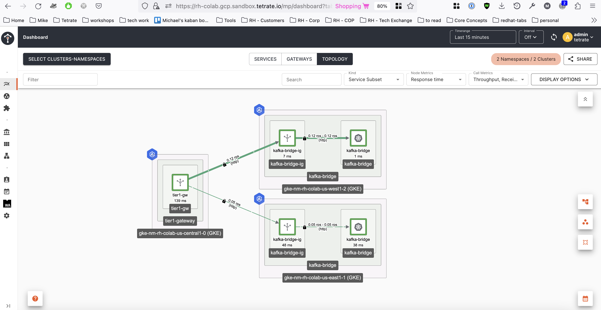

# Red Hat / Tetrate colab blog

# Kafka Bridge failover with TSB

Kafka is a well know streaming solution and with Strimzi you can leverage the benefits of it in Kubernetes. One challenge found in hybrid and multi-cluster architectures with legacy services is the ability to produce and consume messages without the requirement to use the native Kafka protocol. Strimzi meets this gap by not only providing the mechanics to run Kafka in Kubernetes but also to use it through the Kafka Bridge, which provides an API for integrating HTTP-based clients with a Kafka cluster.
The bridge is intended to be used behind a proxy or an API gateway which also paves the way to use L7 traffic management best practices like failing over consumer and producer requests to the Kafka Bridge services using Tetrate Ingress Gateways.


In this blog today we are going to explore the mechanics of how we can provision the kafka broker cluster on our OpenShift environment and expose it through a couple Kafka bridge services in the East and West kubernetes clusters. Then provide access to the bridge services over a cluster ingress gateway that is going to be load balanced using a Tier1 gateway in our central kubernetes cluster.

# Kafka Cluster

To deploy the Kafka Cluster on OpenShift follow the steps below.

## Pre-requisites

- cert-manager
- Openshift cluster
- Cluster onboarded into TSB
- Kafka operator installed

## Login into OCP

Get a token from the UI and login over the terminal:

```bash
oc login --token=sha256~<<TOKEN>> --server=https://api.<<HOSTNAME>>:6443 --insecure-skip-tls-verify=true
```

## Prep Certs

Create a cluster issuer for kafka:

```shell
kubectl apply -f cluster-issuer-selfsigned-issuer-kafka.yaml
```

Create a certificate:

`NOTE` Make sure to update the hostnames in the Certificate `dnsNames` to match the brokers routes usually in the form of:
- openshift-kafka-bootstrap-kafka-cluster.apps.<<YOUR_HOSTNAME>>
- openshift-kafka-0-kafka-cluster.apps.<<YOUR_HOSTNAME>>
- openshift-kafka-1-kafka-cluster.apps.<<YOUR_HOSTNAME>>
- openshift-kafka-2-kafka-cluster.apps.<<YOUR_HOSTNAME>>

```shell
kubectl apply -f certificate-openshift-kafka-cluster.yaml -n kafka-cluster
```

## Deploy Kafka Cluster

```shell
oc apply -f kafka-cluster-persistent.yaml -n kafka-cluster
```

## Check that you have all the kafka pods running:

```shell
k get pods -n kafka-cluster
NAME                                        READY   STATUS    RESTARTS   AGE
openshift-entity-operator-85c5f6949-v6wtp   3/3     Running   0          17h
openshift-kafka-0                           1/1     Running   0          17h
openshift-kafka-1                           1/1     Running   0          17h
openshift-kafka-2                           1/1     Running   0          17h
openshift-zookeeper-0                       1/1     Running   0          17h
openshift-zookeeper-1                       1/1     Running   0          17h
openshift-zookeeper-2                       1/1     Running   0          17h
```

## Test your kafka using `kcat`:

`NOTE` You can get `kcat` docs at https://docs.confluent.io/platform/current/clients/kafkacat-usage.html

```bash
kcat -X security.protocol=SSL -X enable.ssl.certificate.verification=false -b openshift-kafka-bootstrap-kafka-cluster.apps.gke-nmocpt2-us-west1-0.nmocpt2-upic-0.gcp.sandbox.tetrate.io:443 -L
```

Expect an output like:

```bash
Metadata for all topics (from broker -1: ssl://openshift-kafka-bootstrap-kafka-cluster.apps.gke-nmocpt2-us-west1-0.nmocpt2-upic-0.gcp.sandbox.tetrate.io:443/bootstrap):
 3 brokers:
  broker 0 at openshift-kafka-0-kafka-cluster.apps.gke-nmocpt2-us-west1-0.nmocpt2-upic-0.gcp.sandbox.tetrate.io:443 (controller)
  broker 2 at openshift-kafka-2-kafka-cluster.apps.gke-nmocpt2-us-west1-0.nmocpt2-upic-0.gcp.sandbox.tetrate.io:443
  broker 1 at openshift-kafka-1-kafka-cluster.apps.gke-nmocpt2-us-west1-0.nmocpt2-upic-0.gcp.sandbox.tetrate.io:443
 3 topics:
  topic "__strimzi-topic-operator-kstreams-topic-store-changelog" with 1 partitions:
    partition 0, leader 0, replicas: 0,2,1, isrs: 0,2,1
  topic "__strimzi_store_topic" with 1 partitions:
    partition 0, leader 2, replicas: 2,0,1, isrs: 2,0,1
  topic "__consumer_offsets" with 50 partitions:
    partition 0, leader 1, replicas: 1,0,2, isrs: 1,0,2
    partition 1, leader 0, replicas: 0,2,1, isrs: 0,2,1
    partition 2, leader 2, replicas: 2,1,0, isrs: 2,1,0
    partition 3, leader 1, replicas: 1,2,0, isrs: 1,2,0
    partition 4, leader 0, replicas: 0,1,2, isrs: 0,1,2
    partition 5, leader 2, replicas: 2,0,1, isrs: 2,0,1
    partition 6, leader 1, replicas: 1,0,2, isrs: 1,0,2
    partition 7, leader 0, replicas: 0,2,1, isrs: 0,2,1
    partition 8, leader 2, replicas: 2,1,0, isrs: 2,1,0
    partition 9, leader 1, replicas: 1,2,0, isrs: 1,2,0
    partition 10, leader 0, replicas: 0,1,2, isrs: 0,1,2
    partition 11, leader 2, replicas: 2,0,1, isrs: 2,0,1
    partition 12, leader 1, replicas: 1,0,2, isrs: 1,0,2
    partition 13, leader 0, replicas: 0,2,1, isrs: 0,2,1
    partition 14, leader 2, replicas: 2,1,0, isrs: 2,1,0
    partition 15, leader 1, replicas: 1,2,0, isrs: 1,2,0
    partition 16, leader 0, replicas: 0,1,2, isrs: 0,1,2
    partition 17, leader 2, replicas: 2,0,1, isrs: 2,0,1
    partition 18, leader 1, replicas: 1,0,2, isrs: 1,0,2
    partition 19, leader 0, replicas: 0,2,1, isrs: 0,2,1
    partition 20, leader 2, replicas: 2,1,0, isrs: 2,1,0
    partition 21, leader 1, replicas: 1,2,0, isrs: 1,2,0
    partition 22, leader 0, replicas: 0,1,2, isrs: 0,1,2
    partition 23, leader 2, replicas: 2,0,1, isrs: 2,0,1
    partition 24, leader 1, replicas: 1,0,2, isrs: 1,0,2
    partition 25, leader 0, replicas: 0,2,1, isrs: 0,2,1
    partition 26, leader 2, replicas: 2,1,0, isrs: 2,1,0
    partition 27, leader 1, replicas: 1,2,0, isrs: 1,2,0
    partition 28, leader 0, replicas: 0,1,2, isrs: 0,1,2
    partition 29, leader 2, replicas: 2,0,1, isrs: 2,0,1
    partition 30, leader 1, replicas: 1,0,2, isrs: 1,0,2
    partition 31, leader 0, replicas: 0,2,1, isrs: 0,2,1
    partition 32, leader 2, replicas: 2,1,0, isrs: 2,1,0
    partition 33, leader 1, replicas: 1,2,0, isrs: 1,2,0
    partition 34, leader 0, replicas: 0,1,2, isrs: 0,1,2
    partition 35, leader 2, replicas: 2,0,1, isrs: 2,0,1
    partition 36, leader 1, replicas: 1,0,2, isrs: 1,0,2
    partition 37, leader 0, replicas: 0,2,1, isrs: 0,2,1
    partition 38, leader 2, replicas: 2,1,0, isrs: 2,1,0
    partition 39, leader 1, replicas: 1,2,0, isrs: 1,2,0
    partition 40, leader 0, replicas: 0,1,2, isrs: 0,1,2
    partition 41, leader 2, replicas: 2,0,1, isrs: 2,0,1
    partition 42, leader 1, replicas: 1,0,2, isrs: 1,0,2
    partition 43, leader 0, replicas: 0,2,1, isrs: 0,2,1
    partition 44, leader 2, replicas: 2,1,0, isrs: 2,1,0
    partition 45, leader 1, replicas: 1,2,0, isrs: 1,2,0
    partition 46, leader 0, replicas: 0,1,2, isrs: 0,1,2
    partition 47, leader 2, replicas: 2,0,1, isrs: 2,0,1
    partition 48, leader 1, replicas: 1,0,2, isrs: 1,0,2
    partition 49, leader 0, replicas: 0,2,1, isrs: 0,2,1
```

Now you have a functional Kafka cluster and can switch context to the other k8s clusters and install the Kafka bridge. For this you will need the CA used for the Kafka cluster:

```shell
oc extract secret/openshift-kafka-cluster -n kafka-cluster --keys=ca.crt --to=- > ca.crt
```

# Kafka Bridge

In order to install the bridge in a k8s cluster (no OpenShift) you would need to install the Strimzi operator first and get the CA root cert from the cluster where the Kafka cluster is running from.

## Prep namespace

```shell
kubectl create ns kafka-bridge
```

## Deploy the Operator

`NOTE` Perform this step in each k8s target cluster

```shell
helm install my-strimzi-cluster-operator oci://quay.io/strimzi-helm/strimzi-kafka-operator --create-namespace -n kafka-operator --version 0.36.0 --set watchNamespaces="{kafka-bridge}"
```

Check the operator pods are running:

```shell
k get pods -n kafka-operator
NAME                                        READY   STATUS    RESTARTS   AGE
strimzi-cluster-operator-85d7965bf9-hcdfw   1/1     Running   0          2d10h
```
## Deploy the Kafka Bridges

`NOTE` Perform this step in each k8s target cluster

### Prep certs in the target cluster:

1. Using the previously extracted CA create the secret for TLS connection:

```shell
kubectl create secret generic openshift-cluster-ca-cert --from-file=ca.crt -n kafka-bridge
```

### Deploy the bridge

```shell
kubectl apply -f kafka-bridge.yaml -n kafka-bridge
```

`NOTE` Notice how the Kafka Bridge CR has the label `failover: enabled` which is going to be used later on.

Check the bridge pod is running:

```shell
k get pods -n kafka-bridge -w
NAME                                  READY   STATUS    RESTARTS   AGE
kafka-bridge-bridge-b86c49748-cbltz   1/1     Running   0          23s
```

Check the logs to make sure the bridge is working fine:

```bash
k logs kafka-bridge-bridge-b86c49748-cbltz -n kafka-bridge
Preparing truststore
Certificate was added to keystore
Preparing truststore is complete
Kafka Bridge configuration:
#Bridge configuration
bridge.id=kafka-bridge

#Kafka common properties
kafka.bootstrap.servers=openshift-kafka-bootstrap-kafka-cluster.apps.gke-nmocpt2-us-west1-0.nmocpt2-upic-0.gcp.sandbox.tetrate.io:443
kafka.security.protocol=SSL
#TLS/SSL
kafka.ssl.truststore.location=/tmp/strimzi/bridge.truststore.p12
kafka.ssl.truststore.password=[hidden]
kafka.ssl.truststore.type=PKCS12
...
...
...
2023-07-27 15:07:59 INFO  [vert.x-eventloop-thread-0] AppInfoParser:119 - Kafka version: 3.5.0
2023-07-27 15:07:59 INFO  [vert.x-eventloop-thread-0] AppInfoParser:120 - Kafka commitId: c97b88d5db4de28d
2023-07-27 15:07:59 INFO  [vert.x-eventloop-thread-0] AppInfoParser:121 - Kafka startTimeMs: 1690470479736
2023-07-27 15:07:59 INFO  [vert.x-eventloop-thread-0] HttpBridge:102 - HTTP-Kafka Bridge started and listening on port 8080
2023-07-27 15:07:59 INFO  [vert.x-eventloop-thread-0] HttpBridge:103 - HTTP-Kafka Bridge bootstrap servers openshift-kafka-bootstrap-kafka-cluster.apps.gke-nmocpt2-us-west1-0.nmocpt2-upic-0.gcp.sandbox.tetrate.io:443
2023-07-27 15:07:59 INFO  [vert.x-eventloop-thread-2] Application:125 - HTTP verticle instance deployed [2d8cbf0e-49e3-4a9d-8ba7-3ba3cdf38da0]
2023-07-27 15:13:00 INFO  [kafka-admin-client-thread | adminclient-1] NetworkClient:977 - [AdminClient clientId=adminclient-1] Node -1 disconnected.
```

### Test the bridge

Test the bridge by forwarding the port:

```shell
k port-forward deployment/kafka-bridge-bridge -n kafka-bridge 8080:8080
Forwarding from 127.0.0.1:8080 -> 8080
```

```shell
curl -X GET http://localhost:8080/topics
["__strimzi_store_topic","__strimzi-topic-operator-kstreams-topic-store-changelog"]
```

Now you have working Kafka bridges.

# TSB Setup

## Prep:

### TSB Installation

- [tetrate-service-bridge-sandbox](https://github.com/tetrateio/tetrate-service-bridge-sandbox) repo has been used to provision both MP and CP clusters on GCP
- Cluster where MP is, onboarded and ( tier1, gitops enabled )
- Clusters onboarded and gitops enabled
- Setup network and reachability settings between clusters

### Inject the sidecar in the bridge namespaces

In the previous step we had the kafka bridges working, now we need to inject a sidecar proxy and restart the deployments on each k8s cluster where they are running:

```shell
k label ns kafka-bridge istio-injection=enabled
namespace/kafka-bridge labeled
```

```shell
k rollout restart deployment kafka-bridge-bridge -n kafka-bridge
deployment.apps/kafka-bridge-bridge restarted
```

```shell
k get pods -n kafka-bridge
NAME                                  READY   STATUS    RESTARTS   AGE
kafka-bridge-bridge-b86c49748-f7x96   2/2     Running   0          43s
```

Now test your kafka bridge with a sleep container:

```shell
k apply -f https://raw.githubusercontent.com/istio/istio/master/samples/sleep/sleep.yaml -n kafka-bridge
```

```shell
export SLEEP_POD=$(kubectl get pod -n kafka-bridge -l app=sleep -o jsonpath={.items..metadata.name})
```

```shell
kubectl exec -it $SLEEP_POD -n kafka-bridge -c sleep -- curl -X GET http://kafka-bridge-bridge-service.kafka-bridge.svc.cluster.local:8080/topics
```

Check the proxy sidecar logs for the request:

```shell
k logs kafka-bridge-bridge-b86c49748-f7x96 -n kafka-bridge -c istio-proxy
```

## Deployments and Config

Deploy the TSB Tenant, Workspace, Workspace Settings and Gateway group:

`NOTE` For demo purposes this is done in the central k8s cluster

```bash
kustomize build tsb --reorder none | k apply -f -
```

Now deploy the ingress gateways in East and West:

`NOTE` The command below needs to be run in each East/West k8s clusters.

```bash
kustomize build ingress-gateway-east --reorder none | k apply -f -
```

```bash
kustomize build ingress-gateway-west --reorder none | k apply -f -
```

Check the ingress gateway is running:

```shell
k get pods -n kafka-bridge
NAME                                  READY   STATUS    RESTARTS   AGE
kafka-bridge-bridge-b86c49748-lrhwn   2/2     Running   0          2m25s
kafka-bridge-ig-ddf7b8fbc-n94bg       1/1     Running   0          13m
sleep-78ff5975c6-mt95c                2/2     Running   0          88m
```

Now lets get the ingress gateway public IP and test the bridge on each region:

```shell
export GATEWAY_KAFKA_IP=$(kubectl -n kafka-bridge get service kafka-bridge-ig -o jsonpath='{.status.loadBalancer.ingress[0].ip}')
```

```shell
curl -k -v "http://kafka.tetrate.work/topics" \
    --resolve "kafka.tetrate.work:80:${GATEWAY_KAFKA_IP}"
```

Expect a response like:

```shell
* Added kafka.tetrate.work:80:35.237.238.246 to DNS cache
* Hostname kafka.tetrate.work was found in DNS cache
*   Trying 35.237.238.246:80...
* Connected to kafka.tetrate.work (35.237.238.246) port 80 (#0)
> GET /topics HTTP/1.1
> Host: kafka.tetrate.work
> User-Agent: curl/7.87.0
> Accept: */*
> 
* Mark bundle as not supporting multiuse
< HTTP/1.1 200 OK
< content-type: application/vnd.kafka.v2+json
< content-length: 83
< x-envoy-upstream-service-time: 165
< date: Thu, 27 Jul 2023 18:47:30 GMT
< server: istio-envoy
< 
* Connection #0 to host kafka.tetrate.work left intact
["__strimzi_store_topic","__strimzi-topic-operator-kstreams-topic-store-changelog"]
```

Make several requests to each ingress gateway at each k8s cluster and navigate to the TSB UI topology view to see the traffic, expect something like this:


Now we are ready to deploy the tier1 gateway that load balance traffic between the two regional ingress gateways:

`NOTE` Don't forget to update the tier1 gateway config with the onboarded TSB cluster names.
`NOTE` For demo purposes the tier1 gateway is being deployed in the central k8s cluster.

```bash
kustomize build tier1-gateway --reorder none | k apply -f -
```

Test the tier1 gateway by generating traffic:

```shell
export GATEWAY_T1_IP=$(kubectl -n tier1-gateway get service tier1-gw -o jsonpath='{.status.loadBalancer.ingress[0].ip}')
```

```shell
while true; do curl -k "http://kafka.tetrate.work/topics" --resolve "kafka.tetrate.work:80:${GATEWAY_T1_IP}"; sleep 0.5; done
```

Expect traffic to be split between the two ingress gateways:



Now we are ready to test failover of the Kafka bridge across regions.

# Test Kafka Bridge failover with TSB

Now that we have a working setup we are going to deploy a couple traffic generators that are going to emulate the production and consumption of messages to the exposed endpoint on our tier1 gateway so we can failover one of the bridges.

`NOTE` For demo purposes we are going to deploy the producer and consumers in the same central k8s cluster where we have the tier1 gateway.

## Creating a Kafka Bridge consumer

Create a couple consumers:

```shell
curl -k -X POST "http://kafka.tetrate.work/consumers/bridge-quickstart-consumer-group" --resolve "kafka.tetrate.work:80:${GATEWAY_T1_IP}" \
  -H 'content-type: application/vnd.kafka.v2+json' \
  -d '{
    "name": "consumer1",
    "auto.offset.reset": "earliest",
    "format": "json",
    "enable.auto.commit": false,
    "fetch.min.bytes": 512,
    "consumer.request.timeout.ms": 30000
  }'
```

Expect a response like:

```shell
{"instance_id":"consumer1","base_uri":"http://kafka.tetrate.work:80/consumers/bridge-quickstart-consumer-group/instances/consumer1"}
```

```shell
curl -k -X POST "http://kafka.tetrate.work/consumers/bridge-quickstart-consumer-group" --resolve "kafka.tetrate.work:80:${GATEWAY_T1_IP}" \
  -H 'content-type: application/vnd.kafka.v2+json' \
  -d '{
    "name": "consumer2",
    "auto.offset.reset": "earliest",
    "format": "json",
    "enable.auto.commit": false,
    "fetch.min.bytes": 512,
    "consumer.request.timeout.ms": 30000
  }'
```

Expect a response like:

```shell
{"instance_id":"consumer2","base_uri":"http://kafka.tetrate.work:80/consumers/bridge-quickstart-consumer-group/instances/consumer2"}
```

Now subscribe the created consumers to the consumer group:

Consumer1:
```shell
curl -k -X POST "http://kafka.tetrate.work/consumers/bridge-quickstart-consumer-group/instances/consumer1/subscription" --resolve "kafka.tetrate.work:80:${GATEWAY_T1_IP}" -H 'content-type: application/vnd.kafka.v2+json' -d '{"topics": ["bridge-quickstart-topic"]}' -v
```

Consumer2:
```shell
curl -k -X POST "http://kafka.tetrate.work/consumers/bridge-quickstart-consumer-group/instances/consumer2/subscription" --resolve "kafka.tetrate.work:80:${GATEWAY_T1_IP}" -H 'content-type: application/vnd.kafka.v2+json' -d '{"topics": ["bridge-quickstart-topic"]}' -v
```

Test producing messages using the Bridge:

```shell
curl -k -X POST "http://kafka.tetrate.work/topics/bridge-quickstart-topic" --resolve "kafka.tetrate.work:80:${GATEWAY_T1_IP}" -H 'content-type: application/vnd.kafka.json.v2+json' -d '{"records": [{"key": "my-key", "value": "sales-lead-0001"}, {"value": "sales-lead-0002"}, {"value": "sales-lead-0003"}]}'
```

Expect a response like:

```json
{"offsets":[{"partition":0,"offset":11},{"partition":0,"offset":12},{"partition":0,"offset":13}]}
```

Now test retrieving messages from the consumers:

```shell
curl -k -X GET "http://kafka.tetrate.work/consumers/bridge-quickstart-consumer-group/instances/consumer1/records" --resolve "kafka.tetrate.work:80:${GATEWAY_T1_IP}" -H 'accept: application/vnd.kafka.json.v2+json'
```

Expect a response like:

```shell
[{"topic":"bridge-quickstart-topic","key":"my-key","value":"sales-lead-0001","partition":0,"offset":0},{"topic":"bridge-quickstart-topic","key":"my-key","value":"sales-lead-0001","partition":0,"offset":1},{"topic":"bridge-quickstart-topic","key":"my-key","value":"sales-lead-0001","partition":0,"offset":2},{"topic":"bridge-quickstart-topic","key":"my-key","value":"sales-lead-0001","partition":0,"offset":3},{"topic":"bridge-quickstart-topic","key":null,"value":"sales-lead-0003","partition":0,"offset":4},{"topic":"bridge-quickstart-topic","key":"my-key","value":"sales-lead-0001","partition":0,"offset":5},{"topic":"bridge-quickstart-topic","key":null,"value":"sales-lead-0003","partition":0,"offset":6},{"topic":"bridge-quickstart-topic","key":"my-key","value":"sales-lead-0001","partition":0,"offset":7},{"topic":"bridge-quickstart-topic","key":null,"value":"sales-lead-0003","partition":0,"offset":8},{"topic":"bridge-quickstart-topic","key":"my-key","value":"sales-lead-0001","partition":0,"offset":9},{"topic":"bridge-quickstart-topic","key":null,"value":"sales-lead-0003","partition":0,"offset":10},{"topic":"bridge-quickstart-topic","key":"my-key","value":"sales-lead-0001","partition":0,"offset":11},{"topic":"bridge-quickstart-topic","key":null,"value":"sales-lead-0002","partition":0,"offset":12},{"topic":"bridge-quickstart-topic","key":null,"value":"sales-lead-0003","partition":0,"offset":13}]
```

Now that we tested the producers and consumers, lets deploy the traffic generators in the central k8s cluster to generate traffic:

```shell
k create ns producer consumer1 consumer2
```

```shell
k apply producer.yaml -n producer
```

```shell
k apply consumer1.yaml -n consumer1
```

```shell
k apply consumer2.yaml -n consumer2
```

`NOTE` Please update the tier1 external service IPs in the producers/consumers.


## Failover Test

Scale down the deployment in East or West `kafka-bridge` service to simulate a fail:

```shell
k scale kafkabridges.kafka.strimzi.io kafka-bridge -n kafka-bridge --replicas=0
```

Observe on the TSB UI how the requests are being redirected from one region's ingress gateway to the other:


In the picture above we can see the west ingress gateway detected the west kafka bridge was down and redirected the requests across region to the east kafka bridge.


# Conclusion

Using Kafka Bridge instances replicated across regions in order to provide high availability and in conjunction with Tetrate Service Bridge ability to load balance and failover the bridge instances, creates an extra layer in between the consumers and producers in a streaming architecture providing better abstraction for multi-cluster topologies.